## Project Steps

1. [Development](#development)
2. [Setup kubernetes cluster](#setup-kubernetes-cluster)
3. [Setup CircleCI](#setup-circleci)
4. [CI/CD Pipeline](#cicd-pipeline)

<hr>

### Development

- Simple flask application with basic deployment using blue-green pattern.

<hr>

### Local check
- **Develop**

  ```
  $ make setup
  $ make install
  $ make test
  $ make lint
  $ make run-app
  ```
- **Docker Containerization**
  ```
  $ make build-docker
  $ make run-docker
  $ make upload-docker
  ```
<hr>

### Setup kubernetes cluster
- Install aws cli
- Install eksctl
- Install kubectl
- Create Amazon EKS cluster:
  1. Create key pair: `primary-key` use to connect to nodes in cluster.
  2. Use [infa/cluster.yaml](./infa/cluster.yaml) to create Amazon EKS cluster
      ```
     $ eksctl create cluster -f infa/cluster.yaml
     ```
     - Stacks:
     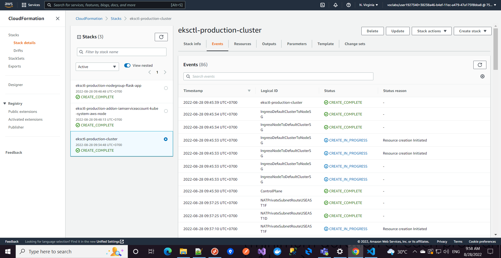
     - Cluster:
     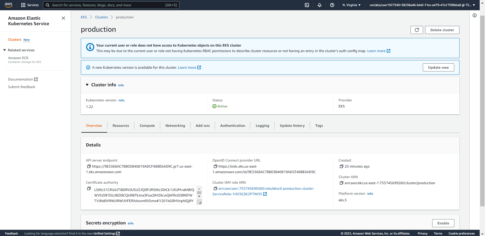
  3. Configure `kubectl` for Amazon EKS (this is also config permission access to EKS):
      ```
     $ aws eks --region us-west-2 update-kubeconfig --name production
     $ kubectl config current-context
      ```
  4. Check nodes
      ```
     $ kubectl get nodes
      ```
     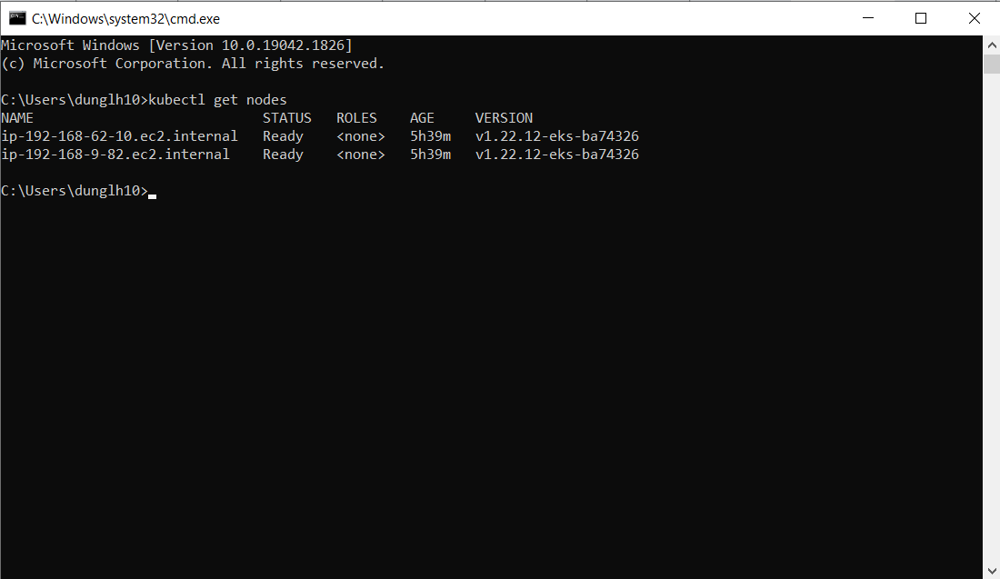
- Publish version 1.0:
  1. Build and push docker image version 1.0 to docker-hub container
     ```
     $ make build-docker
     $ make upload-docker
     ```
  2. Publish the version 1.0 user docker image [hoangdung99er/flask-app:1.0](https://hub.docker.com/layers/279736749/hoangdung99er/flask-app/1.0/images/sha256-82d6aff27b063a1ce530d2a12fa37763cb35901ff7a5b2309f6286f690dac9b5?context=repo) (create a deployment `flask-app-1-0` using the [k8s/1.0/deployment.yaml](./k8s/1.0/deployment.yaml) file and create a service `flask-app` using the [k8s/1.0/service.yaml](./k8s/1.0/service.yaml) file)
     ```
     $ kubectl apply -f k8s/1.0/deployment.yaml
     $ kubectl apply -f k8s/1.0/service.yaml
     ```
     That is blue version 1.0
  3. Check result
     ```
     $ kubectl get all
     ```
     ![kubectl_get_all_1.0.png]
     Go to ELB's URL to check flask-app version 1.0
     ![flask_app_blue_1.0.png]
<hr>

### Setup CircleCI
- `AWS_ACCESS_KEY_ID`=(from IAM user with programmatic access)
- `AWS_SECRET_ACCESS_KEY`=(from IAM user with programmatic access)
- `AWS_DEFAULT_REGION`=(your default region in aws)
- `CLUSTER_NAME`=(your eks cluster name, eg: production)
- `DOCKER_LOGIN`=(your username to login https://hub.docker.com/)
- `DOCKER_PASSWORD`=(your password to login https://hub.docker.com/)
- `DOCKER_HUB_ID`=(your docker id in https://hub.docker.com/, eg: hoangdung99er)
- `DOCKER_REPOSITORY`={your repository in https://hub.docker.com/, eg: flask-app}
<hr>

### CI/CD Pipeline
Overview:
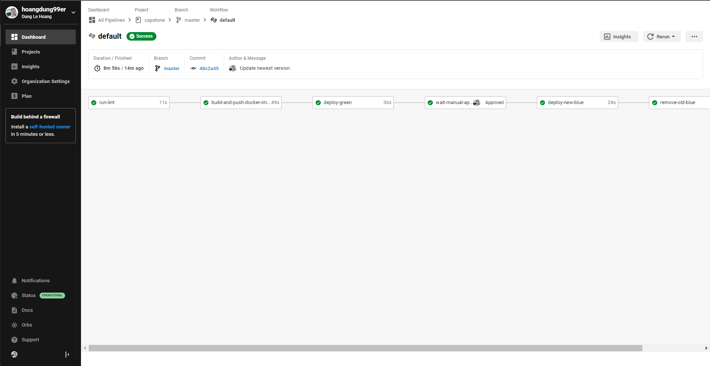
Steps:
1. run-lint: use `hadolint` and `pylint`, check for linting error of docker file
  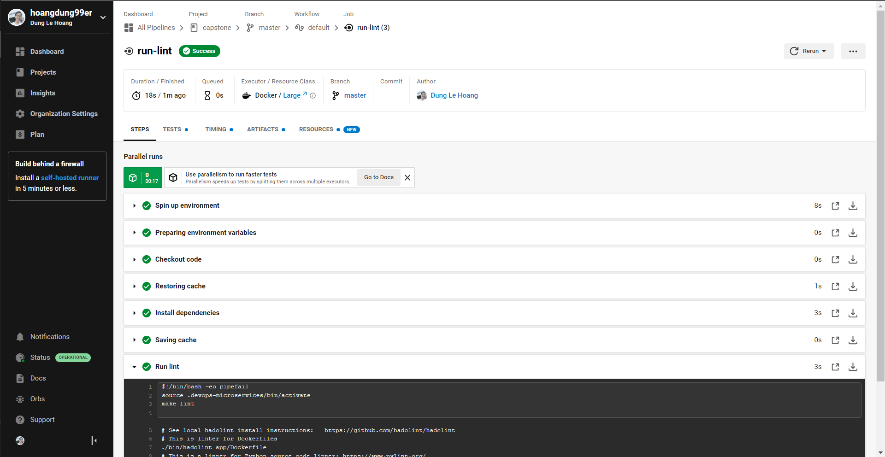
2. build-and-push-docker-image: build and push docker image to https://hub.docker.com/
  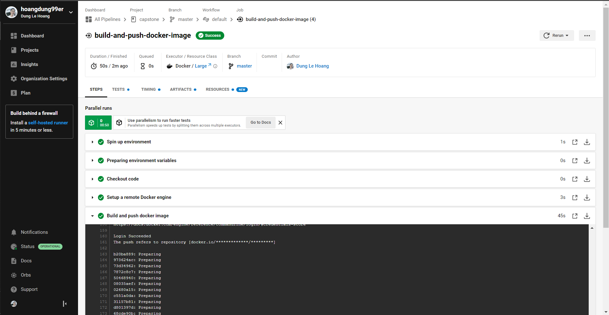
- Link to [flask-app Image](https://hub.docker.com/repository/docker/hoangdung99er/flask-app/general)
3. deploy-green: publish the new version as green
- Using the blue/green deployment pattern, follow the [link](https://docs.aws.amazon.com/whitepapers/latest/overview-deployment-options/bluegreen-deployments.html)
- Use [k8s/deployment.yaml] file to create new deployment `flask-app-$LABEL_VERSION`
- Use [k8s/service-green.yaml] file to create a new service (a new Load Balancer) `flask-app-green`, the service only for testing purposes.
  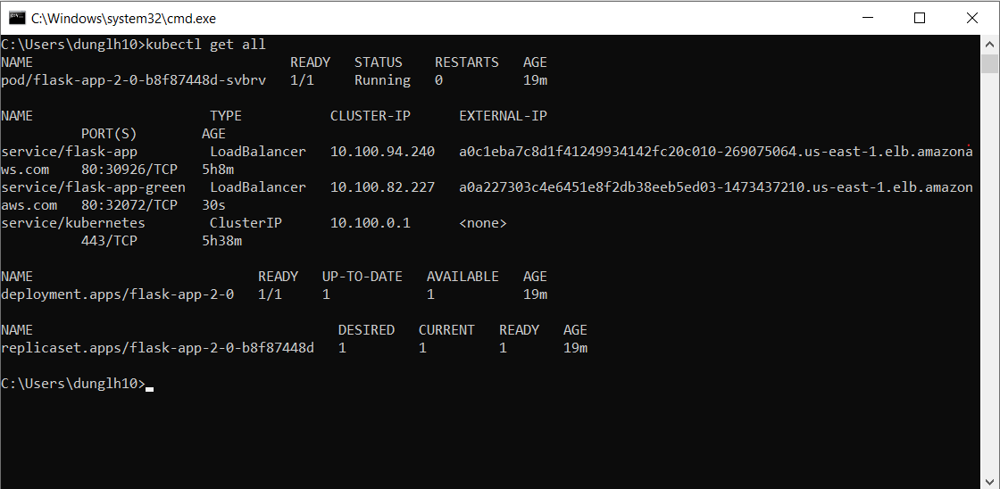
- Green deployment:
  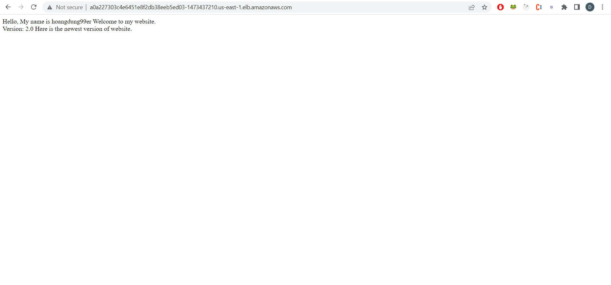
- Blue deployment:
  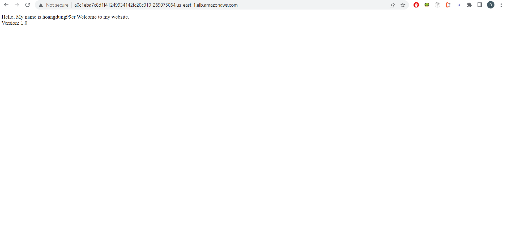
6. wait-manual-approval: wait manual approval to keep continue building the new version - new blue after verifying that our new version (green deployment) is working correctly.
   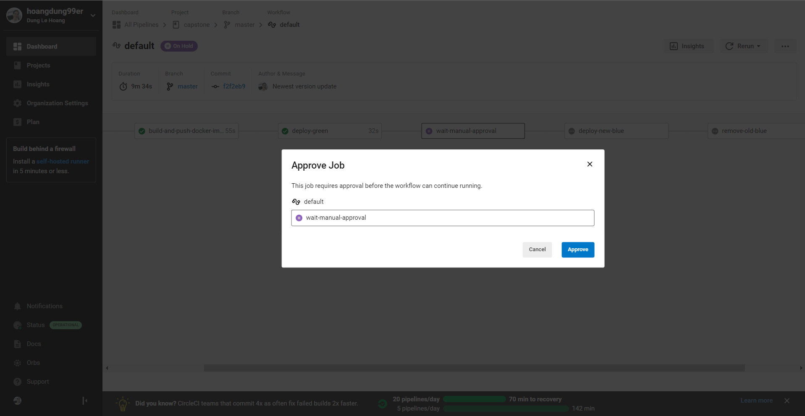
7. deploy-new-blue: target the new version - new blue
- Blue deployment:
  
8. remove-old-blue: free up the resources (with previous version)
   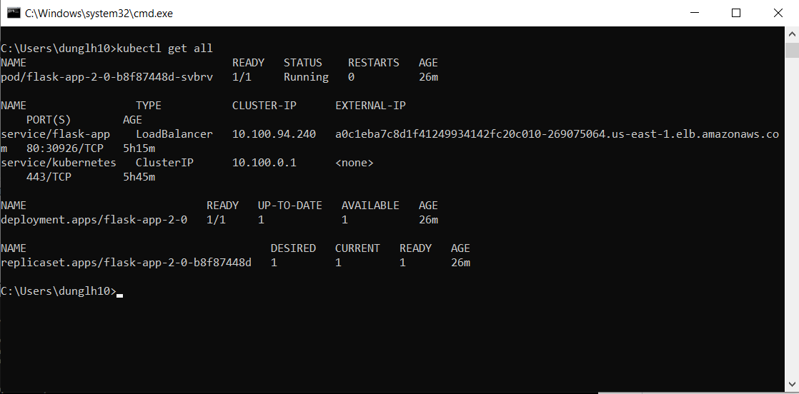